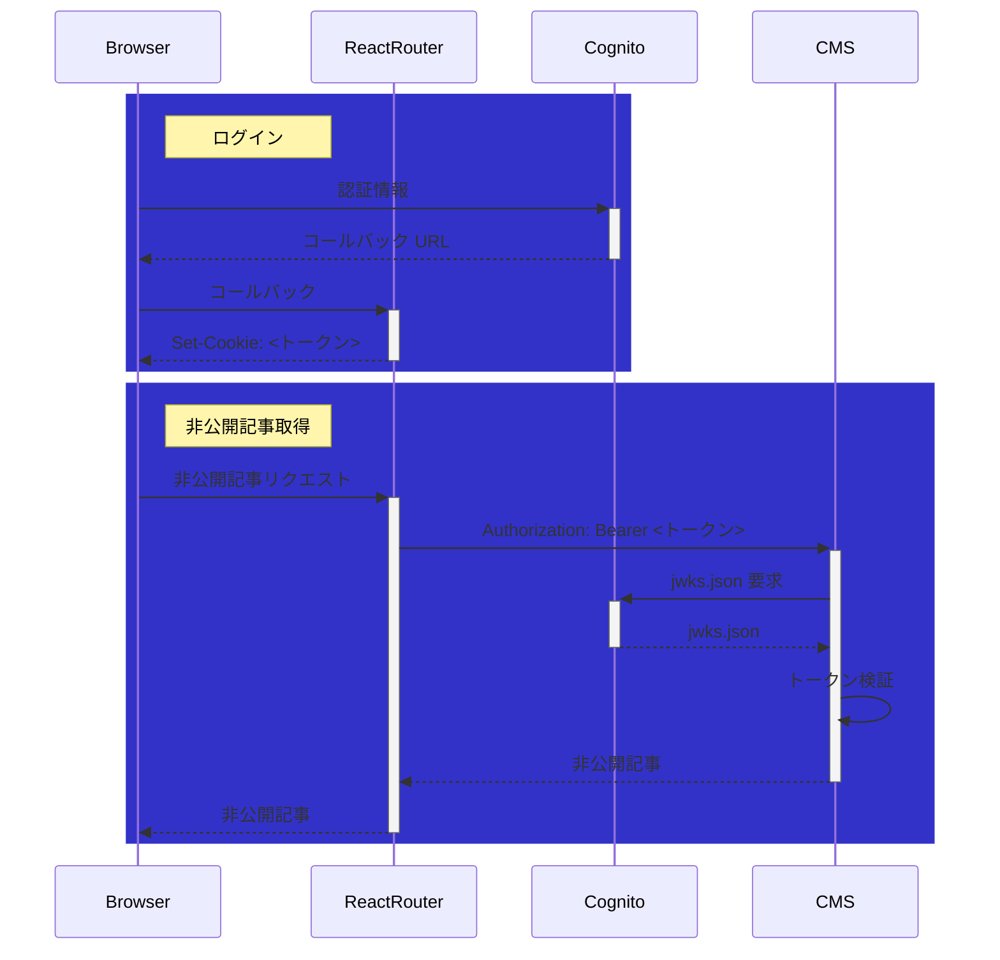

# 認可

```mermaid
sequenceDiagram
  participant Browser
  participant ReactRouter
  participant Cognito
  participant CMS

  rect rgb(50, 50, 200)
  note right of Browser: ログイン
  Browser ->>+ Cognito: 認証情報
  Cognito -->>- Browser: コールバック URL
  Browser ->>+ ReactRouter: コールバック
  ReactRouter -->>- Browser: Set-Cookie: <トークン>
  end
  rect rgb(50, 50, 200)
  note right of Browser: 非公開記事取得
  Browser ->>+ ReactRouter: 非公開記事リクエスト
  ReactRouter ->>+ CMS: Authorization: Bearer <トークン>
  CMS ->>+ Cognito: jwks.json 要求
  Cognito -->>- CMS: jwks.json
  CMS ->> CMS: トークン検証
  CMS -->>- ReactRouter: 非公開記事
  ReactRouter -->>- Browser: 非公開記事
  end
```
